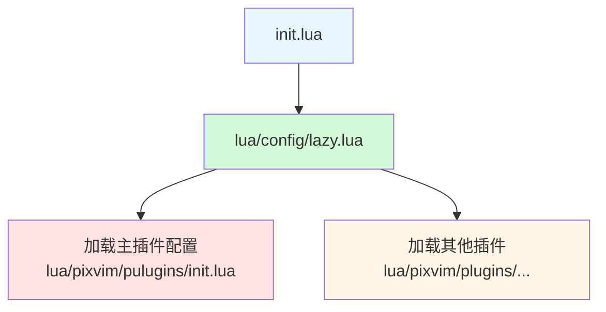
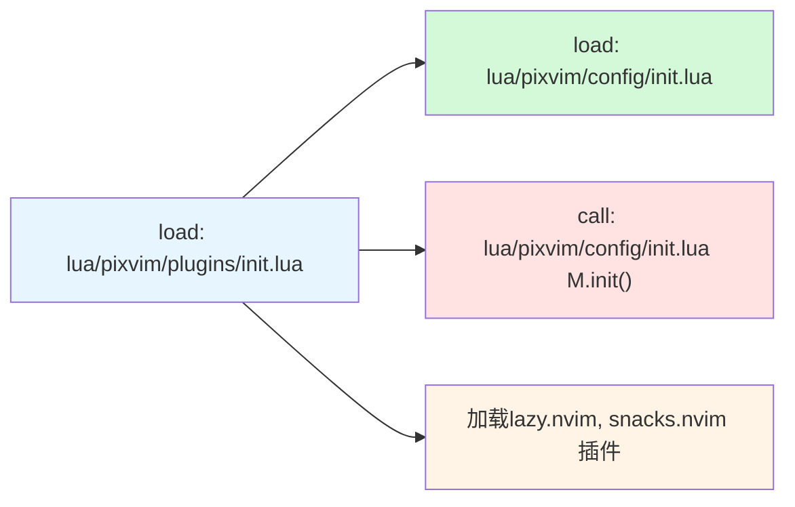
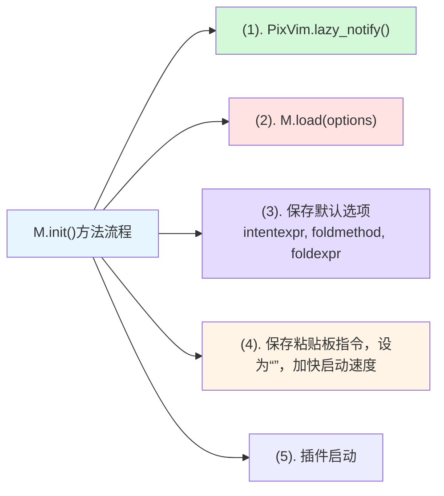
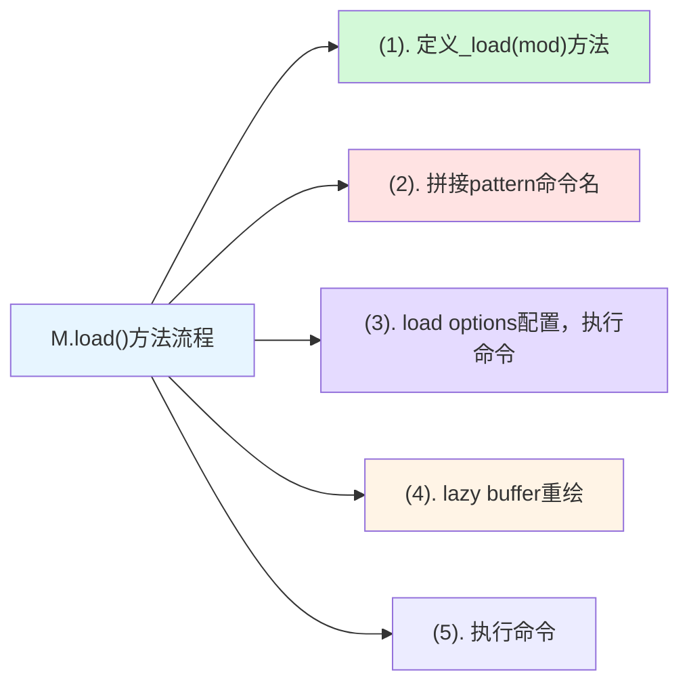

# nvimlua

我的neovim 配置, 抱着学习的态度，完全掌控的自己的配置慢慢打磨。

> [!TIP] 缘起
> 把 `LazyVim` 作为配置一点点搬到这个项目中。
> `LazyVim` 是一个插件，而我这里直接配置。

## 用了那些主要插件？

编辑器主要使用了哪些插件，插件的作用是什么？

| 插件名 | 作用 |
| -------------- | --------------- |
| folke/lazy.nvim | 插件管理器 |
| akinsho/bufferline.nvim | Buffer栏，提供Buff显示和操作功能 |
|  lewis6991/gitsigns.nvim | 提供符号列显示Git的变更标记<br>Git一些相关操作 |
| ellisonleao/gruvbox.nvim  | 颜色主题 |
| nvim-lualine/lualine.nvim  | 状态栏 |
| nvim-mini/mini.pairs | 自动补全括号，跳过括号|
|  folke/snacks.nvim|  文件浏览，选择器插件等诸多通用插件 |
| stevearc/conform.nvim | 格式化插件 |
| folke/lazydev.nvim |  自动配置内置lsp |
| mfussenegger/nvim-lint |  自动配置内置lint补充 |
| mason-org/mason.nvim | 管理 LSP, DAP, linter 和格式化程序 |
| nvimtools/none-ls.nvim | 为不支持lsp的的工具也能像lsp工作 |
| neovim/nvim-lspconfig | 自动配置各个语言的相关配置，使得配置变得简单 |
| iamcco/markdown-preview.nvim | Markdown预览插件 |
| MeanderingProgrammer/render-markdown.nvim | 在neovim中渲染markdown |
| folke/flash.nvim | 快速跳转功能 |
| MagicDuck/grug-far.nvim | 搜索替换增强 |
| nvim-mini/mini.ai | 文本对象名词增强 |
| rafamadriz/friendly-snippets | 不同编程语言的片段组合 |
| rafamadriz/friendly-snippets | 不同编程语言的片段组合 |
| folke/which-key.nvim | 按键提示插件 |
| saghen/blink.cmp | 智能提示插件 |
| rafamadriz/friendly-snippets | 不同编程语言的片段组合 |
| mason-org/mason-lspconfig.nvim | 桥接mason和lspconfig的插件 |
| nvim-treesitter/nvim-treesitter | tree-sitter 编程工具语法高亮，缩进，折叠 |
| nvim-treesitter/nvim-treesitter-textobjects | 基于语法树的文本对象、选择、移动、交换和查看支持。 |
| windwp/nvim-ts-autotag | 使用 Treesitter 自动关闭和自动重命名 HTML/XML 标签 |
| nvim-mini/mini.icons | 图表库 |
| folke/noice.nvim | 优化 message, cmdline, popupmenu |
| MunifTanjim/nui.nvim | UI组件库 |
| nvim-tree/nvim-web-devicons | 该插件为每个图标提供相同的图标和颜色 |
| folke/persistence.nvim | 会话管理插件 |
| nvim-lua/plenary.nvim | 函数库插件 |

## 快捷键

快捷键是使用的关键, 所以放在最前面。

### 模式切换

模式切换 <kbd>j</kbd><kbd>k</kbd>

### 窗口焦点切换

- <kbd>Ctrl</kbd>+<kbd>h</kbd>: 焦点切换左窗口
- <kbd>Ctrl</kbd>+<kbd>j</kbd>: 焦点切换下窗口
- <kbd>Ctrl</kbd>+<kbd>k</kbd>: 焦点切换上窗口
- <kbd>Ctrl</kbd>+<kbd>l</kbd>: 焦点切换下窗口

### 窗口大小调整

- <kbd>Ctrl</kbd>+<kbd>Shift</kbd>+<kbd>Up</kbd>: 窗口向上下扩大
- <kbd>Ctrl</kbd>+<kbd>Shift</kbd>+<kbd>Down</kbd>: 窗口上下缩小
- <kbd>Ctrl</kbd>+<kbd>Shift</kbd>+<kbd>Left</kbd>: 窗口左右缩小
- <kbd>Ctrl</kbd>+<kbd>Shift</kbd>+<kbd>Right</kbd>: 窗口左右扩大

### 行移动

- <kbd>Ctrl</kbd>+<kbd>Shift</kbd>+<kbd>j</kbd>: 行下移
- <kbd>Ctrl</kbd>+<kbd>Shift</kbd>+<kbd>k</kbd>: 行上移

### Buffer相关

- <kdb>Shift</kdb>+<kbd>h</kbd>: 上一个Buffer
- <kdb>Shift</kdb>+<kbd>l</kbd>: 下一个Buffer
- <kdb>[</kdb>+<kbd>b</kbd>: 上一个Buffer
- <kdb>]</kdb>+<kbd>b</kbd>: 下一个Buffer
- <kdb>LEADER<kdb>+<kbd>b</kbd><kbd>b</kbd>: 另一个Buffer
- <kdb>LEADER<kdb>+<kbd>`</kbd>: 另一个Buffer

### 文件浏览器snacks

| 按键 | 说明 |
| -------------- | --------------- |
| <kbd>LEADER</kbd> + <kbd>e</kbd> | 打开/关闭文件浏览器(root目录) |
| <kbd>LEADER</kbd> + <kbd>E</kbd> | 打开/关闭文件浏览器(working dir) |
| <kbd>LEADER</kbd> + <kbd>fe</kbd> | 定位文件位置在文件浏览器(root目录) |
| <kbd>LEADER</kbd> + <kbd>fE</kbd> | 定位文件位置在文件浏览器(working dir) |

#### 通知

| 按键 | 说明 |
| -------------- | --------------- |
| <kbd>LEADER</kbd> + <kbd>n</kbd> | 打开查看通知的历史 |
| <kbd>LEADER</kbd> + <kbd>un</kbd> | 取消所有显示的通知 |

#### Picker中切换root目录

| 按键 | 说明 |
| -------------- | --------------- |
| <kbd>Alt</kbd> + <kbd>c</kbd> | Picker打开时，切换root目录 |

#### Snacks picker按键

| 按键 | 说明 |
| -------------- | --------------- |
| <kbd>LEADER</kbd> + <kbd>,</kbd> | Picker Buffers |

#### snacks扩展终端模式切换窗口

| 按键 | 功能 | 说明 |
|------|------|------|
| <kbd>Ctrl</kbd> + <kbd>h</kbd> | 跳转到左侧窗口 | 在终端模式下切换到左边的窗口 |
| <kbd>Ctrl</kbd> + <kbd>j</kbd> | 跳转到下方窗口 | 在终端模式下切换到下方的窗口 |
| <kbd>Ctrl</kbd> + <kbd>k</kbd> | 跳转到上方窗口 | 在终端模式下切换到上方的窗口 |
| <kbd>Ctrl</kbd> + <kbd>l</kbd> | 跳转到右侧窗口 | 在终端模式下切换到右边的窗口 |

#### snacks全局扩展按键

| 按键 | 功能 | 说明 |
|------|------|------|
| <kbd>LEADER</kbd> + <kbd>.</kbd> | 切换临时缓冲区 | 打开或关闭一个临时的草稿缓冲区，用于快速记录想法 |
| <kbd>LEADER</kbd> + <kbd>S</kbd> | 选择临时缓冲区 | 从已有的临时缓冲区列表中选择一个打开 |
| <kbd>LEADER</kbd> + <kbd>dps</kbd> | 性能分析临时缓冲区 | 打开一个用于性能分析的临时缓冲区 |

#### snacks picker

| 按键 | 功能 | 详细说明 |
|------|------|----------|
| <kbd>LEADER</kbd> + <kbd>,</kbd> | 缓冲区列表 | 显示打开的缓冲区列表 |
| <kbd>LEADER</kbd> + <kbd>/</kbd> | 根目录搜索 | 在项目根目录中进行 Grep 搜索 |
| <kbd>LEADER</kbd> + <kbd>:</kbd> | 命令历史 | 显示命令历史记录 |
| <kbd>LEADER</kbd> + <kbd>Space</kbd> | 根目录文件查找 | 在项目根目录中查找文件 |
| <kbd>LEADER</kbd> + <kbd>n</kbd> | 通知历史 | 显示通知历史记录 |

#### 查找文件相关 (<kbd>LEADER</kbd> + <kbd>f</kbd>)

| 按键 | 功能 | 详细说明 |
|------|------|----------|
| <kbd>LEADER</kbd> + <kbd>fb</kbd> | 缓冲区列表 | 显示打开的缓冲区列表 |
| <kbd>LEADER</kbd> + <kbd>fB</kbd> | 所有缓冲区 | 显示所有缓冲区（包括隐藏和非文件） |
| <kbd>LEADER</kbd> + <kbd>fc</kbd> | 配置文件 | 查找配置文件 |
| <kbd>LEADER</kbd> + <kbd>ff</kbd> | 根目录文件 | 在项目根目录中查找文件 |
| <kbd>LEADER</kbd> + <kbd>fF</kbd> | 当前目录文件 | 在当前目录中查找文件 |
| <kbd>LEADER</kbd> + <kbd>fg</kbd> | Git 文件 | 查找 Git 仓库中的文件 |
| <kbd>LEADER</kbd> + <kbd>fr</kbd> | 最近文件 | 显示最近打开的文件 |
| <kbd>LEADER</kbd> + <kbd>fR</kbd> | 当前目录最近文件 | 显示当前目录的最近文件 |
| <kbd>LEADER</kbd> + <kbd>fp</kbd> | 项目列表 | 显示项目列表 |

#### Git 相关 (<kbd>LEADER</kbd> + <kbd>g</kbd>)

| 按键 | 功能 | 详细说明 |
|------|------|----------|
| <kbd>LEADER</kbd> + <kbd>gd</kbd> | Git Diff | 显示 Git 变更块 |
| <kbd>LEADER</kbd> + <kbd>gD</kbd> | Git 与 Origin 比较 | 与 Origin 分支的差异比较 |
| <kbd>LEADER</kbd> + <kbd>gs</kbd> | Git 状态 | 显示 Git 状态 |
| <kbd>LEADER</kbd> + <kbd>gS</kbd> | Git Stash | 显示 Git Stash 列表 |
| <kbd>LEADER</kbd> + <kbd>gi</kbd> | GitHub Issues | 显示打开的 GitHub Issues |
| <kbd>LEADER</kbd> + <kbd>gI</kbd> | 所有 GitHub Issues | 显示所有 GitHub Issues |
| <kbd>LEADER</kbd> + <kbd>gp</kbd> | GitHub PRs | 显示打开的 GitHub Pull Requests |
| <kbd>LEADER</kbd> + <kbd>gP</kbd> | 所有 GitHub PRs | 显示所有 GitHub Pull Requests |

#### 搜索相关 (<kbd>LEADER</kbd> + <kbd>s</kbd>)

| 按键 | 功能 | 详细说明 |
|------|------|----------|
| <kbd>LEADER</kbd> + <kbd>sb</kbd> | 缓冲区行 | 搜索缓冲区中的行 |
| <kbd>LEADER</kbd> + <kbd>sB</kbd> | 缓冲区内容搜索 | 在打开的缓冲区中进行 Grep 搜索 |
| <kbd>LEADER</kbd> + <kbd>sg</kbd> | 根目录实时搜索 | 在项目根目录中进行实时 Grep 搜索 |
| <kbd>LEADER</kbd> + <kbd>sG</kbd> | 当前目录实时搜索 | 在当前目录中进行实时 Grep 搜索 |
| <kbd>LEADER</kbd> + <kbd>sp</kbd> | 插件配置搜索 | 搜索插件配置 |
| <kbd>LEADER</kbd> + <kbd>sw</kbd> | 单词/选区搜索 | 搜索光标下单词或选区内容（根目录） |
| <kbd>LEADER</kbd> + <kbd>sW</kbd> | 单词/选区搜索 | 搜索光标下单词或选区内容（当前目录） |
| <kbd>LEADER</kbd> + <kbd>s"</kbd> | 寄存器 | 显示寄存器内容 |
| <kbd>LEADER</kbd> + <kbd>s/</kbd> | 搜索历史 | 显示搜索历史记录 |
| <kbd>LEADER</kbd> + <kbd>sa</kbd> | 自动命令 | 显示自动命令列表 |
| <kbd>LEADER</kbd> + <kbd>sc</kbd> | 命令历史 | 显示命令历史记录 |
| <kbd>LEADER</kbd> + <kbd>sC</kbd> | 命令列表 | 显示可用命令列表 |
| <kbd>LEADER</kbd> + <kbd>sd</kbd> | 诊断信息 | 显示所有缓冲区的诊断信息 |
| <kbd>LEADER</kbd> + <kbd>sD</kbd> | 当前缓冲区诊断 | 显示当前缓冲区的诊断信息 |
| <kbd>LEADER</kbd> + <kbd>sh</kbd> | 帮助页面 | 搜索帮助页面 |
| <kbd>LEADER</kbd> + <kbd>sH</kbd> | 高亮组 | 显示高亮组列表 |
| <kbd>LEADER</kbd> + <kbd>si</kbd> | 图🧠标 | 显示可用图标 |
| <kbd>LEADER</kbd> + <kbd>sj</kbd> | 跳转列表 | 显示跳转历史 |
| <kbd>LEADER</kbd> + <kbd>sk</kbd> | 按键映射 | 显示按键映射 |
| <kbd>LEADER</kbd> + <kbd>sl</kbd> | 位置列表 | 显示位置列表 |
| <kbd>LEADER</kbd> + <kbd>sM</kbd> | 手册页 | 搜索手册页 |
| <kbd>LEADER</kbd> + <kbd>sm</kbd> | 标记 | 显示标记列表 |
| <kbd>LEADER</kbd> + <kbd>sR</kbd> | 恢复搜索 | 恢复之前的搜索 |
| <kbd>LEADER</kbd> + <kbd>sq</kbd> | 快速修复列表 | 显示快速修复列表 |
| <kbd>LEADER</kbd> + <kbd>su</kbd> | 撤销树 | 显示撤销历史树 |

#### UI 相关 (<kbd>LEADER</kbd> + <kbd>u</kbd>)

| 按键 | 功能 | 详细说明 |
|------|------|----------|
| <kbd>LEADER</kbd> + <kbd>uC</kbd> | 颜色方案 | 显示并切换颜色方案 |

`snacks_picker` 是一个功能强大的选择器插件，提供了丰富的搜索和导航功能，通过这些快捷键可以快速访问各种 Vim/Neovim 功能。

### treesitter

| 按键 | 功能 | 目标对象 | 说明 |
|-------|-------|-----------|------|
| <kbd>]</kbd><kbd>f</kbd> | 跳转到下一个函数的开始 | `@function.outer` | 移动光标到下一个函数的起始位置 |
| <kbd>]</kbd><kbd>F</kbd> | 跳转到下一个函数的结束 | `@function.outer` | 移动光标到下一个函数的结束位置 |
| <kbd>[</kbd><kbd>f</kbd> | 跳转到上一个函数的开始 | `@function.outer` | 移动光标到上一个函数的起始位置 |
| <kbd>[</kbd><kbd>F</kbd> | 跳转到上一个函数的结束 | `@function.outer` | 移动光标到上一个函数的结束位置 |
| <kbd>]</kbd><kbd>c</kbd> | 跳转到下一个类的开始 | `@class.outer` | 移动光标到下一个类的起始位置 |
| <kbd>]</kbd><kbd>C</kbd> | 跳转到下一个类的结束 | `@class.outer` | 移动光标到下一个类的结束位置 |
| <kbd>[</kbd><kbd>c</kbd> | 跳转到上一个类的开始 | `@class.outer` | 移动光标到上一个类的起始位置 |
| <kbd>[</kbd><kbd>C</kbd> | 跳转到上一个类的结束 | `@class.outer` | 移动光标到上一个类的结束位置 |
| <kbd>]</kbd><kbd>a</kbd> | 跳转到下一个参数的开始 | `@parameter.inner` | 移动光标到下一个参数的起始位置 |
| <kbd>]</kbd><kbd>A</kbd> | 跳转到下一个参数的结束 | `@parameter.inner` | 移动光标到下一个参数的结束位置 |
| <kbd>[</kbd><kbd>a</kbd> | 跳转到上一个参数的开始 | `@parameter.inner` | 移动光标到上一个参数的起始位置 |
| <kbd>[</kbd><kbd>A</kbd> | 跳转到上一个参数的结束 | `@parameter.inner` | 移动光标到上一个参数的结束位置 |

#### 按键规律

| 方向 | 开始位置 | 结束位置 |
|-------|-----------|-----------|
| 下一个 | <kbd>]</kbd> + 小写字母 | <kbd>]</kbd> + 大写字母 |
| 上一个 | <kbd>[</kbd> + 小写字母 | <kbd>[</kbd> + 大写字母 |

#### 对象类型映射

| 字母 | 对象类型 | Treesitter 查询 |
|-------|-----------|---------------|
| <kbd>f</kbd> | 函数 | `@function.outer` |
| <kbd>c</kbd> | 类 | `@class.outer` |
| <kbd>a</kbd> | 参数 | `@parameter.inner` |

#### 代码错误检查开关

| 按键 | 说明 |
| -------------- | --------------- |
| <kbd>LEADER</kbd> + <kbd>t</kbd> + <kbd>d</kbd> | 开启关闭错误检查 |

### Flash 插件快捷键

| 按键 | 模式 | 说明 |
|------|------|------|
| <kbd>s</kbd> | 普通模式、可视模式、操作符等待模式 | Flash 跳转 |
| <kbd>S</kbd> | 普通模式、可视模式、操作符等待模式 | Flash Treesitter 跳转 |
| <kbd>r</kbd> | 操作符等待模式 | 远程 Flash |
| <kbd>R</kbd> | 操作符等待模式、可视模式 | Treesitter 搜索 |
| <kbd>Ctrl</kbd>+<kbd>s</kbd> | 命令行模式 | 切换 Flash 搜索 |
| <kbd>Ctrl</kbd>+<kbd>Space</kbd> | 普通模式、可视模式、操作符等待模式 | Treesitter 增量选择 |

==快捷键说明==

| 按键 | 功能 | 详细说明 |
|------|------|----------|
| <kbd>s</kbd> | Flash 跳转 | 快速跳转到标签、光标位置等 |
| <kbd>S</kbd> | Flash Treesitter | 基于 Treesitter 语法树的跳转 |
| <kbd>r</kbd> | 远程 Flash | 远程跳转功能 |
| <kbd>R</kbd> | Treesitter 搜索 | 基于 Treesitter 的搜索功能 |
| <kbd>Ctrl</kbd>+<kbd>s</kbd> | 切换搜索 | 在命令行模式下切换 Flash 搜索 |
| <kbd>Ctrl</kbd>+<kbd>Space</kbd> | 增量选择 | 模拟 nvim-treesitter 的增量选择功能 |

### grug-far

| 按键 | 功能 | 详细说明 |
|------|------|----------|
| <kbd>LEADER</kbd> + <kbd>sr</kbd> | 搜索替换增强 | `grug-far` 增强搜索替换插件 |

### mini.ai

==名词增强==

- **自定义文本对象**：
  - `o`：代码块（block、条件语句、循环）
  - `f`：函数（function）
  - `c`：类（class）
  - `t`：HTML/XML 标签
  - `d`：数字
  - `e`：单词（区分大小写）
  - `g`：整个缓冲区
  - `u`/`U`：函数调用

### markdown-preview

| 按键 | 功能 | 详细说明 |
|------|------|----------|
| <kbd>LEADER</kbd> + <kbd>cp</kbd> | 预览markdown | 预览 markdown 在浏览器中 |

### mason

| 按键 | 功能 | 详细说明 |
|------|------|----------|
| <kbd>LEADER</kbd> + <kbd>cm</kbd> | Mason管理 | 打开Mason管理面板 |

### nvim-lspconfig

| 按键 | 功能 | 详细说明 |
|------|------|----------|
| <kbd>LEADER</kbd> + <kbd>cl</kbd> | LSP 信息 | 显示 LSP 配置信息 |
| <kbd>gd</kbd> | 跳转定义 | 跳转到光标下符号的定义位置 |
| <kbd>gr</kbd> | 引用查找 | 查找光标下符号的所有引用 |
| <kbd>gI</kbd> | 跳转实现 | 跳转到光标下符号的实现位置 |
| <kbd>gy</kbd> | 跳转类型定义 | 跳转到光标下符号的类型定义 |
| <kbd>gD</kbd> | 跳转声明 | 跳转到光标下符号的声明位置 |
| <kbd>K</kbd> | 悬浮文档 | 显示光标下符号的文档信息 |
| <kbd>gK</kbd> | 签名帮助 | 显示函数签名信息 |
| <kbd>Ctrl</kbd> + <kbd>k</kbd> | 签名帮助 | 插入模式下显示函数签名 |
| <kbd>LEADER</kbd> + <kbd>ca</kbd> | 代码操作 | 显示可用的代码操作（普通模式、可视模式） |
| <kbd>LEADER</kbd> + <kbd>cc</kbd> | 运行 Codelens | 执行代码透镜操作（普通模式、可视模式） |
| <kbd>LEADER</kbd> + <kbd>cC</kbd> | 刷新 Codelens | 刷新并显示代码透镜 |
| <kbd>LEADER</kbd> + <kbd>cR</kbd> | 重命名文件 | 重命名当前文件并更新引用 |
| <kbd>LEADER</kbd> + <kbd>cr</kbd> | 重命名符号 | 重命名光标下的符号 |
| <kbd>LEADER</kbd> + <kbd>cA</kbd> | 源码操作 | 显示源码级别的操作 |
| <kbd>]]</kbd> | 下一个引用 | 跳转到下一个高亮引用 |
| <kbd>[[</kbd> | 上一个引用 | 跳转到上一个高亮引用 |
| <kbd>Alt</kbd> + <kbd>n</kbd> | 下一个引用 | 跳转到下一个高亮引用（带预览） |
| <kbd>Alt</kbd> + <kbd>p</kbd> | 上一个引用 | 跳转到上一个高亮引用（带预览） |

这些按键提供了完整的 LSP 功能支持，包括导航、代码操作、重命名和引用查找等核心功能。

### which-key

| 按键 | 功能 | 详细说明 |
|------|------|----------|
| <kbd>LEADER</kbd> + <kbd>?</kbd> | 缓冲区按键映射 | 显示当前缓冲区的按键映射（非全局） |
| <kbd>Ctrl</kbd> + <kbd>w</kbd> + <kbd>Space</kbd> | 窗口模式 | 显示窗口相关的按键映射 |

#### 按键前缀分组

| 按键前缀 | 分组名称 | 详细说明 |
|----------|----------|----------|
| <kbd>LEADER</kbd> + <kbd>Tab</kbd> | tabs | 标签页相关操作 |
| <kbd>LEADER</kbd> + <kbd>c</kbd> | code | 代码相关操作 |
| <kbd>LEADER</kbd> + <kbd>d</kbd> | debug | 调试相关操作 |
| <kbd>LEADER</kbd> + <kbd>dp</kbd> | profiler | 性能分析相关操作 |
| <kbd>LEADER</kbd> + <kbd>f</kbd> | file/find | 文件和查找相关操作 |
| <kbd>LEADER</kbd> + <kbd>g</kbd> | git | Git 相关操作 |
| <kbd>LEADER</kbd> + <kbd>gh</kbd> | hunks | Git 变更块相关操作 |
| <kbd>LEADER</kbd> + <kbd>q</kbd> | quit/session | 退出和会话相关操作 |
| <kbd>LEADER</kbd> + <kbd>s</kbd> | search | 搜索相关操作 |
| <kbd>LEADER</kbd> + <kbd>u</kbd> | ui | 界面相关操作 |
| <kbd>LEADER</kbd> + <kbd>x</kbd> | diagnostics/quickfix | 诊断和快速修复相关操作 |
| <kbd>LEADER</kbd> + <kbd>b</kbd> | buffer | 缓冲区相关操作（动态扩展） |
| <kbd>LEADER</kbd> + <kbd>w</kbd> | windows | 窗口相关操作（代理到 `<c-w>`） |
| <kbd>[</kbd> | prev | 上一个相关操作 |
| <kbd>]</kbd> | next | 下一个相关操作 |
| <kbd>g</kbd> | goto | 跳转相关操作 |
| <kbd>gs</kbd> | surround | 包围相关操作 |
| <kbd>z</kbd> | fold | 折叠相关操作 |
| <kbd>gx</kbd> | 系统应用打开 | 使用系统默认应用打开光标下的链接或文件 |

which-key 插件本身不提供具体功能，而是为其他插件的按键提供可视化的帮助和分组管理，让用户更容易记住和使用各种快捷键。

### Noice 插件按键映射

#### 消息管理（普通模式）

| 按键 | 功能 | 说明 |
|------|------|------|
| `<leader>sn` | Noice 菜单组 | 打开 Noice 相关命令的前缀键 |
| `<leader>snl` | 最后一条消息 | 显示 Noice 记录的最后一条消息 |
| `<leader>snh` | 消息历史 | 查看 Noice 的消息历史记录 |
| `<leader>sna` | 所有消息 | 显示所有 Noice 消息 |
| `<leader>snd` | 清除所有 | 关闭/清除所有 Noice 消息 |
| `<leader>snt` | 消息选择器 | 使用 Telescope 或 FzfLua 选择消息 |

#### 命令行模式

| 按键 | 模式 | 功能 | 说明 |
|------|------|------|------|
| `<S-Enter>` | 命令行模式 (`c`) | 重定向命令行 | 将当前命令行内容重定向到其他地方 |

#### 滚动控制（多模式）

| 按键 | 模式 | 功能 | 说明 |
|------|------|------|------|
| `<C-f>` | 插入/普通/选择模式 (`i,n,s`) | 向前滚动 | 在 Noice 消息中向前滚动 4 行，如果没有消息则正常滚动 |
| `<C-b>` | 插入/普通/选择模式 (`i,n,s`) | 向后滚动 | 在 Noice 消息中向后滚动 4 行，如果没有消息则正常滚动 |

### persistence.nvim

| 按键 | 功能 | 详细说明 |
|------|------|----------|
| <kbd>LEADER</kbd> + <kbd>qs</kbd> | 恢复会话 | 恢复当前目录的会话（包括打开的缓冲区、窗口布局等） |
| <kbd>LEADER</kbd> + <kbd>qS</kbd> | 选择会话 | 从已保存的会话列表中选择一个进行恢复 |
| <kbd>LEADER</kbd> + <kbd>ql</kbd> | 恢复最后一次会话 | 恢复最近一次保存的会话 |
| <kbd>LEADER</kbd> + <kbd>qd</kbd> | 不保存当前会话 | 停止会话保存功能，退出时不保存当前会话状态 |

## 选项

| 设置 leader 键配置 | 说明 |
| -------------- | --------------- |
| `vim.g.mapleader = " "` | LEADER |
| `vim.g.maplocalleader = "\\"`|LOCALLEADER|

| 基本配置 | 说明 |
| -------------- | --------------- |
|`vim.opt.number = true`|  显示行号|
|`vim.opt.relativenumber = true`|  显示相对行号|
|`vim.opt.cursorline = true`|  显示光标所在行的高亮|
|`vim.opt.signcolumn = "yes"`| 显示侧边栏符号|
|`vim.g.autoformat = true`| 自动格式化 |

| 缩进设置 | 说明 |
| -------------- | --------------- |
|`vim.opt.tabstop = 4`| 制表符宽度为4|
|`vim.opt.shiftwidth = 4`| 自动缩进宽度为4|
|`vim.opt.expandtab = true`| 将制表符转换为空格|
|`vim.opt.smartindent = true`| 智能缩进|

| 搜索设置 | 说明 |
| -------------- | --------------- |
|`vim.opt.smartindent = true`| 智能缩进|
|`vim.opt.ignorecase = true`| 搜索时忽略大小写|
|`vim.opt.smartcase = true`| 智能大小写搜索|
|`vim.opt.hlsearch = true`| 搜索时高亮匹配项|
|`vim.opt.incsearch = true`| 输入搜索模式时实时高亮|

| 文件处理 | 说明 |
| -------------- | --------------- |
|`vim.opt.autoread = true`| 自动读取外部修改的文件|

剪贴板

```c
-- 剪贴板
opt.clipboard = "unnamedplus"
-- 如果是在 SSH 环境下，利用 OSC 52 协议同步剪贴板
if vim.env.SSH_CONNECTION then
    vim.g.clipboard = {
        name = 'OSC 52',
        copy = {
            ['+'] = require('vim.ui.clipboard.osc52').copy('+'),
            ['*'] = require('vim.ui.clipboard.osc52').copy('*'),
        },
        paste = {
            ['+'] = require('vim.ui.clipboard.osc52').paste('+'),
            ['*'] = require('vim.ui.clipboard.osc52').paste('*'),
        },
    }
end
```

## 2026-01-26

- checkout main branch
- 删除旧的配置重新开始

### 配置基础选项

- 配置目录 `lua/config/options.lua`

`init.lua` 引入配置：

```lua
require("config.options")
```

- 配置快捷键 `lua/config/keymaps.lua`

### 引入插件管理器[lazy.nvim](https://github.com/folke/lazy.nvim)

- 配置到 `lua/config/lazy.lua`
- 参考笔记
  - [001_lazy_nvim.md](https://github.com/pixb/ai-neovim-study/note/plugin/001_lazy_nvim.md)
参考Demo:
  - [plugin-001-lazy-nvim](https://github.com/pixb/ai-neovim-study/config-demo/plugin-001-lazy-nvim)

### 安装gruvbox主题

- `lua/plugins/ui/gruvbox.lua`

### 安装文件浏览插件和图标插件

- `lua/plugins/ui/nvim-tree.lua`
- `lua/plugins/ui/nvim-web-devicons.lua`

配置快捷键 `lua/config/keymap.lua`

```lua
-- 切换文件树
vim.keymap.set("n", "<leader>e", ":NvimTreeToggle<CR>", { noremap = true, silent = true, desc = "切换文件树" })

-- 定位当前文件
vim.keymap.set(
 "n",
 "<leader>f",
 ":NvimTreeFindFile<CR>",
 { noremap = true, silent = true, desc = "定位当前文件" }
)
```

### 参考LazyVim配置选项

```lua
-- localleader
vim.g.maplocalleader = "\\"
-- 自动格式化
vim.g.autoformat = true
```

### 处理剪贴板设置

```c
vim.opt.clipboard = "unnamedplus"

if vim.env.SSH_CONNECTION then
    vim.g.clipboard = {
        name = "OSC 52",
        copy = {
            ["+"] = require("vim.ui.clipboard.osc52").copy("+"),
            ["*"] = require("vim.ui.clipboard.osc52").copy("*"),
        },
        paste = {
            ["+"] = require("vim.ui.clipboard.osc52").paste("+"),
            ["*"] = require("vim.ui.clipboard.osc52").paste("*"),
        },
    }
end
```

### 参考 LazyVim 配置option

- [LazyVim](https://github.com/LazyVim/LazyVim/blob/main/lua/lazyvim/config/options.lua)
- 抄了大量的选项配置

### 参考 LazyVim 配置keymaps

- [LazyVim](https://github.com/LazyVim/LazyVim/blob/main/lua/lazyvim/config/keymaps.lua)
- 抄了大量的选项配置

### 引入folke/snacks.nvim

- 工具插件，包含大量功能
- Buffer相关使用

```lua
  {
    "folke/snacks.nvim",
    priority = 1000,
    lazy = false,
    opts = {},
    config = function(_, opts)
      local notify = vim.notify
      require("snacks").setup(opts)
    end,
  },
  ```

### 创建全局配置

这个参考是 LazyVim 配置 bufferline 插件,需要用到全局配置的图标选项。

- [ui-plugin](https://github.com/LazyVim/LazyVim/blob/main/lua/lazyvim/plugins/ui.lua)
- 于是学着写配置
- `lua/config/init.lua`

## 2026-01-28

### snacks_explorer.lua

配置文件浏览器，采用 `folke/snacks.nvim`

- 配置复制根据 [snacks_explorer.lua](https://github.com/LazyVim/LazyVim/blob/main/lua/lazyvim/plugins/extras/editor/snacks_explorer.lua)
- 目录 `/lua/plugins/editor/snacks_explorer.lua`
- 需要定位项目根目录 `root()` 的函数。

### 启动加载结构更换

- `lua/config/init.lua`,定义 `PixVim`
- `init.lua`,`PixVim.setup()` 启动

### root()函数定义

- 定义获取项目根目录的函数
- `lua/util/root.lua`

### 加载顺序

==整体流程==

- `init.lua`
- 加载 `lua/config/init.lua`
  - 加载 `lua/cofing/options.lua`
  - 加载 `lua/config/lazy.lua`
  - 加载 `lua/config/keymap.lua`
  - PixVim: 设置 `require("pixvim.util")`
  - `PixVim.config = M.config`
  - `PixVim.root.setup()`

==加载插件==

- 加载 `lua/config/lazy.lua`
- `folke/lazy.nvim` 初始化
- 加载 `lua/plugins/ui` 中插件
- `bufferline.lua`
- `gruvbox.lua`
- `nvim-web-devicons.lua`
- 加载 `lua/plugins/editor` 中插件
- `snacks.lua`

### 添加lualine

- `lua/plugins/ui/lualine.lua`
- 需要详细学习lualine的配置

### 加入 VeryLazy command

生命周期

```c
Neovim 启动
    ↓
加载 lazyvim.config.init()
    ↓
加载基本配置（options）
    ↓
lazy.nvim 开始加载插件
    ↓
加载核心插件（LazyVim、snacks.nvim 等）
    ↓
加载其他插件（按优先级）
    ↓
lazy.nvim 触发 VeryLazy 事件
    ↓
执行所有监听 VeryLazy 的 autocmd
    ↓
    ├── LazyVim 的初始化（keymaps、autocmds 等）
    ├── 加载 event = "VeryLazy" 的插件
    └── 执行 LazyVim.on_very_lazy() 注册的函数
    ↓
Neovim 完全就绪
```

- `lua/pixvim/util/init.lua
- `function M.on_very_lazy(fn)`

### 安装 nui.nvim 和 noice.nvim

优化 message, cmdline, popupmenu.

- `lua/plugins/ui/nui.lua`
- `lua/plugins/ui/noice.lua`

### 安装 mini.icons

图标库。

- `lua/plugins/ui/mini-icons.lua

### 配置lsp

- lsp的配置采用最新版本的方案
- 参考 [新版lsp笔记](./devdoc/00_nvim011版本lsp还需要nvim-lspconfig插件吗.md)
- 另外仍然需要 `nvim-lspconfig` 插件具体参考 [笔记](./devdoc/00_nvim011版本lsp还需要nvim-lspconfig插件吗.md)
- 解决 `lua_ls` lsp不能提示 `neovim api` 的问题, [笔记](./devdoc/03_lsp_支持neovim的api.md)

## 2026-01-30

### 配置 lazydev.nvim 插件

- `lua/plugins/coding/lazydev.lua`

### 配置 blink

- `lua/plugins/lsp/blink.lua`

### 配置 which-key.nvim 插件

- `lua/plugins/editor/which-key.lua`

## 2026-01-31

### 梳理 snacks 插件

- `lua/plugins/editor/snacks.lua`

==文件浏览器==

文件浏览器, option

```lua
  opts = {
    explorer = {}
  },
```

==缩进可视化==

```lua
indent = { enabled = true },
```

==输入框美化==

```lua
input = { enabled = true },
```

==通知框美化==

```
notifier = { enabled = true },
```

==作用域模块==
==代码作用域分析==
==高亮缩进线==

```lua
scope = { enabled = true },
```

==平滑滚动==

```lua
scroll = { enabled = true },
```

==状态栏，自定义状态栏==

```lua
statuscolumn = { enabled = false }, -- we set this in options.lua
```

==切换功能==

```lua
toggle = { map = PixVim.safe_keymap_set },
```

==单词高亮==

```lua
words = { enabled = true },
```

==picker==

- 选择器
- 注意切换目录快捷键 `Alt + C` 与 `iTerm2` 终端按键冲突导致无法触发。
- 打开Picker，按 <kbd>Alt</kbd> +  <kdb>c</kbd>: 切换root目录

### nvim-treesitter

- 配置语法分析插件 `treesitter`.
- `lua/plugins/lsp/treesitter.lua`
- `nvim-treesitter/nvim-treesitter`
- 版本保持最新
- 处理编译相关的配置
- 支持缩进，高亮，折叠
- `nvim-treesitter-textobjects`: 语法增强插件函数，类，参数，条件语句
- `windwp/nvim-ts-autotag`: 自动关闭标签插件
- `lua/pixvim/util/treesitter.lua`: 工具类

==常用 Treesitter 查询==

可以用于跳转

| 查询 | 说明 |
|-------|------|
| `@function.outer` | 整个函数 |
| `@function.inner` | 函数体 |
| `@class.outer` | 整个类 |
| `@class.inner` | 类体 |
| `@parameter.outer` | 整个参数（包括类型） |
| `@parameter.inner` | 参数名称 |
| `@variable.outer` | 整个变量声明 |
| `@variable.inner` | 变量名 |
| `@statement.outer` | 整个语句 |
| `@comment.outer` | 整个注释 |
| `@string.outer` | 整个字符串（包括引号） |
| `@string.inner` | 字符串内容（不包括引号） |

## 2026-02-02

### markdown相关

- `stevearc/conform.nvim`:  格式化插件
- `mfussenegger/nvim-lint`: nvim-lint插件
- `iamcco/markdown-preview.nvim`: 语言markdown
- `MeanderingProgrammer/render-markdown.nvim`: 在 `neovim` 中直接渲染 `markdown`.

### formatting格式化插件

关于格式化,定义工具类，引入插件，初始化。

- 工具定义: [format.lua](./lua/pixvim/util/format.lua)
- 插件引入: [formatting.lua](./lua/plugins/coding/formatting.lua)
- 初始化：[init.lua](./lua/config/init.lua)

### lint相关

- 插件引入: [linting.lua](./lua/plugins/coding/linting.lua)

==markdwon默认关闭Lint==

- 在 [autocmds.lua](./lua/config/autocmds.lua) 中定义。

==定义开关lint检查==

自己认为非常重要，可以清爽的显示。

`lua/pixvim/plugins/coding/linting.lua`

```lua
-- 完整的诊断控制快捷键
vim.keymap.set("n", "<leader>td", function()
 local bufnr = 0
 local is_enabled = vim.diagnostic.is_enabled({ bufnr = bufnr })

 if is_enabled then
  vim.diagnostic.enable(false, { bufnr = bufnr })
  vim.notify("Diagnostics disabled", vim.log.levels.INFO)
 else
  vim.diagnostic.enable(true, { bufnr = bufnr })
  vim.notify("Diagnostics enabled", vim.log.levels.INFO)
 end
end, { desc = "Toggle diagnostics" })
```

### 重新改变文件结构

使得项目结构和 LazyVim 基本结构一致

### 再次梳理流程

==主流程==



- 首先入口 `init.lua`, 首先加载 `lua/config/lazy.lua`
- `lua/config/lazy.lua`
  - `lazy.vim` 插件安装的配置。
  - 启动 `lazy.vim` 加载插件。
  - 首先加载 `lua/pixvim/plugins/init.lua`
  - 再加载其他插件

==pixvim插件init流程==



- `lua/pixvim/plugins/init.lua`
  - `lua/pixvim/config.lua init()` 配置初始化
  - 加载基本插件：`lazy.nvim`, `snacks.nvim`.
- `lua/pixvim/config/init.lua` 加载
  - 加载 `lua/lazyvim/util/init.lua` 赋值 `_G.LazyVim`.
  - 定义 `M={}`.
  - 定义 `M.version`.
  - 定义 `local defaults`.
  - 定义 `M.json`
  - 定义 `function M.json.load()`
  - 定义 `local options`
  - 定义 `local lazy_clipboard`
  - 定义 `function M.setup(opts)`
  - 定义 `function M.get_kind_filter(buf)`
  - 定义 `function M.load(name)`
  - 定义 `M.did_init`
  - 定义 `M._options`
  - 定义 `M.init()`
  - 定义 `local default_extras`
  - 定义 `function M.get_defaults()`
  - 定义 `setmetatable()`: 设置元表

### lua/pixvim/config/init.lua 流程

==lua/pixvim/config/init.lua M.init()方法流程==



- `lua/pixvim/plugins/init.lua`
  - `lua/pixvim/config.lua init()` 配置初始化
  - 加载基本插件：`lazy.nvim`, `snacks.nvim`.
- `lua/pixvim/config/init.lua` 加载
  - 加载 `lua/lazyvim/util/init.lua` 赋值 `_G.LazyVim`.
  - 定义 `M={}`.
  - 定义 `M.version`.
  - 定义 `local defaults`.
  - 定义 `M.json`
  - 定义 `function M.json.load()`
  - 定义 `local options`
  - 定义 `local lazy_clipboard`
  - 定义 `function M.setup(opts)`
  - 定义 `function M.get_kind_filter(buf)`
  - 定义 `function M.load(name)`
  - 定义 `M.did_init`
  - 定义 `M._options`
  - 定义 `M.init()`
  - 定义 `local default_extras`
  - 定义 `function M.get_defaults()`
  - 定义 `setmetatable()`: 设置元表

==lua/pixvim/config/init.lua M.load()方法流程==



### 配置插件flash跳转及选择插件

`lua/pixvim/plugins/editor/flash.lua`

## 2026-02-06

### 配置mini.pairs 插件

- `lua/pixvim/plugins/coding/minipairs.lua`
- 自动补全括号，花括号，引号等配对字符串
- 智能跳过右括号

### 配置mini.ai插件

**一句话总结**：这是一个增强版的 Vim 文本对象插件，通过 Treesitter 语法分析提供更智能、更精确的代码块选择功能。

**核心要点**：

- **核心概念**：`mini.ai` 是一个基于 Treesitter 的文本对象增强插件，扩展了 Vim 原生的文本对象（如 `ciw`、`da(`）功能
- **工作原理**：利用 Neovim 的 Treesitter 解析器理解代码语法结构，提供基于语义的文本对象选择
- **自定义文本对象**：
  - `o`：代码块（block、条件语句、循环）
  - `f`：函数（function）
  - `c`：类（class）
  - `t`：HTML/XML 标签
  - `d`：数字
  - `e`：单词（区分大小写）
  - `g`：整个缓冲区
  - `u`/`U`：函数调用

**背景与价值**：

- **提出背景**：Vim 原生文本对象仅基于字符和简单语法，无法理解代码的语义结构
- **解决的问题**：解决了精确选择代码块、函数、类等语义单元的痛点，提升代码编辑效率
- **带来的价值**：让代码重构、修改更加精准，大幅提升开发体验

**演进历程**：

1. **初始阶段**：Vim 原生提供基础的文本对象（如 `w`、`p`、`(`、`[` 等）
2. **发展阶段**：出现插件扩展文本对象（如 `vim-textobj-user`），但主要基于正则匹配
3. **成熟阶段**：结合 Treesitter 语法分析，实现语义级别的文本对象识别
4. **当前状态**：`mini.ai` 提供轻量级、高性能的解决方案，支持自定义多种文本对象
5. **发展趋势**：更智能的代码理解，支持更多编程语言和复杂的代码结构模式

- 插件配置: `lua/pixvim/plugin/editor/mini-ai.lua`

## 2026-02-14

### MagicDuck/grug-far.nvim搜索替换

- `MagicDuck/grug-far.nvim`
- 搜索替换插件
- `lua/pixvim/plugins/editor/grug-far.lua`

### 使用snack插件扩展功能

- `lua/pixvim/plugins/editor/snacks.lua`

```lua
opts = {
  bigfile = { enabled = true },
  quickfile = { enabled = true },
```

- **bigfile**: 大文件优化功能。当打开大文件时，自动禁用一些耗时的功能（如语法高亮、自动格式化等），以提高编辑性能
- **quickfile**: 快速文件功能，优化文件打开速度

### 添加 persistence 会话管理插件

- `lua/pixvim/plugins/util/presisitence.lua`

### 添加函数库插件 plenary

- `lua/pixvim/plugins/util/plenary.lua`

## 2026-02-19

需要引入的扩展插件配置, 参考LazyVim.

```lua
    { import = "lazyvim.plugins.extras.dap.core" },
    { import = "lazyvim.plugins.extras.lang.markdown" },
    { import = "lazyvim.plugins.extras.editor.outline" },
    { import = "lazyvim.plugins.extras.util.dot" },
    { import = "lazyvim.plugins.extras.lang.clangd" },
    { import = "lazyvim.plugins.extras.lang.cmake" },
    { import = "lazyvim.plugins.extras.lang.python" },
    { import = "lazyvim.plugins.extras.lang.go" },
    { import = "lazyvim.plugins.extras.coding.luasnip" },
    { import = "lazyvim.plugins.extras.coding.mini-surround" }
```

### 引入go开发

- `lua/pixvim/plugins/lang/go.lua`

### 浮动Terminal按键配置

```lua
-- floating terminal
map("n", "<leader>fT", function() Snacks.terminal() end, { desc = "Terminal (cwd)" })
map("n", "<leader>ft", function() Snacks.terminal(nil, { cwd = LazyVim.root() }) end, { desc = "Terminal (Root Dir)" })
map({"n","t"}, "<c-/>",function() Snacks.terminal(nil, { cwd = LazyVim.root() }) end, { desc = "Terminal (Root Dir)" })
map({"n","t"}, "<c-_>",function() Snacks.terminal(nil, { cwd = LazyVim.root() }) end, { desc = "which_key_ignore" })
```
